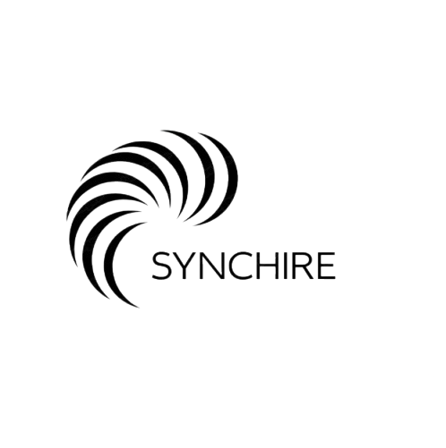

<div align="center">
  <br />
    
  </a>
  <br />

  <div>
    
    
    
    
  </div>

  <h3 align="center">SynchHire</h3>
</div>

---

## 📋 Table of Contents
1. ✨ [Introduction](#introduction)
2. ⚙️ [Tech Stack](#tech-stack)
3. 🔋 [Features](#features)
4. 🤸 [Quick Start](#quick-start)
5. 🚀 [Additional Info](#more)

---

---

## ✨ Introduction <a name="introduction"></a>

**SynchHire** is an AI-powered **Applicant Tracking & Resume Matching System** built with React, TypeScript, and Puter.js.
It streamlines the hiring process by analyzing resumes, scoring them against job listings, and providing intelligent, ATS-style feedback — all without a backend.

With a sleek interface, instant setup, and browser-based AI processing, SynchHire empowers recruiters and job seekers alike with efficient, privacy-first hiring tools.

---

## ⚙️ Tech Stack <a name="tech-stack"></a>

- **[React](https://react.dev/):** Component-based UI library for building dynamic web interfaces.
- **[React Router v7](https://reactrouter.com/):** Advanced routing solution with loaders, actions, and SSR support.
- **[Puter.js](https://jsm.dev/resumind-puterjs):** Lightweight client SDK providing serverless auth, storage, and AI directly in the browser.
- **[Tailwind CSS](https://tailwindcss.com/):** Utility-first CSS framework for responsive, modern design.
- **[TypeScript](https://www.typescriptlang.org/):** Adds type safety and better tooling for scalable applications.
- **[Vite](https://vite.dev/):** Fast dev server and build tool optimized for modern web apps.
- **[Zustand](https://github.com/pmndrs/zustand):** Minimal state management library with excellent performance.

---

## 🔋 Features <a name="features"></a>

- ⚡ **Serverless Authentication:** Handle user login and session management fully client-side via Puter.js.
- 📁 **Smart Resume Uploads:** Store and manage multiple resumes securely within your browser.
- 🤖 **AI-Powered Analysis:** Match resumes to job listings and receive ATS-style evaluation scores.
- 💬 **Personalized Feedback:** Get AI-generated insights and optimization tips for each resume.
- 🧩 **Reusable Components:** Clean, modular React architecture with consistent design.
- 📱 **Responsive UI:** Optimized for desktop, tablet, and mobile using Tailwind CSS.
- 🧠 **Modern UX:** Intuitive navigation and visually cohesive layouts powered by shadcn/ui.

---

## <a name="quick-start">🤸 Quick Start</a>

Follow these steps to run **SynchHire** locally.

### **Prerequisites**
Ensure you have the following installed:
- [Git](https://git-scm.com/)
- [Node.js](https://nodejs.org/)
- [npm](https://www.npmjs.com/)

### **Cloning the Repository**
```bash
git clone https://github.com/mideyolu/synchhire.git
cd synchhire

---

**Installation**

Install the project dependencies using npm:

```bash
npm install
```

**Running the Project**

```bash
npm run dev
```

Open [http://localhost:5173](http://localhost:5173) in your browser to view the project.
